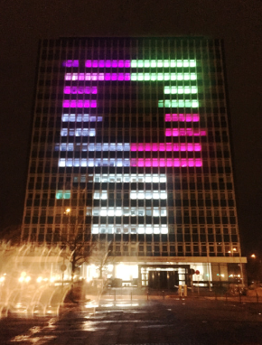

# Project Lighthouse
A collection of games running on the University of Kiel's high-rise building.

 

## Project Structure

### Core application framework

| Module | MVC Components | Contents |
| ------ | -------------- | -------- |
| app | View, ViewController, (Model) | The main Lighthouse application. |
| shared | ViewModel, (ViewController, Model) | The graphics and animation API. |

### Game modules

| Module | MVC Components | Contents |
| ------ | -------------- | -------- |
| puzzle | Model, ViewModel, ViewController, Controller | The original puzzle game. |
| snake | Model, ViewModel, Controller | The classic snake game. |
| breakout | Model, ViewModel, Controller | The game "Breakout". |
| spaceinvaders | Model, ViewModel, Controller | The game "Space Invaders". |

New game modules are currently registered in [`AppViewController`](app/src/main/java/lighthouse/ui/AppViewController.java).

## Lighthouse API
To use the Lighthouse API, create a new file named `authentication.txt` inside `src/main/resources` with the following contents:

```properties
username=YOUR_USERNAME
token=YOUR_API_TOKEN
```

> Login at https://lighthouse.uni-kiel.de/login to generate a new API token and to see the transmitted Lighthouse grid.

## Discord API
To connect to the Discord API, create a new file named `discordToken.txt` inside `src/main/resources` with the following contents:

```properties
token=YOUR_AUTHENTICATION_TOKEN
clientID=OPTIONAL_CLIENT_ID
```

## UI Architecture
The application implements a variant of the well-known MVC pattern. The responsibilities are as follows:

### Inputs
* accepts raw input events and sends them to a responder

### Responders
* handle user input

> Responders usually process a "higher-level" representation of user input (which is closer to the actual domain) rather than raw mouse events.

### View Controllers
Loosely speaking, view controllers coordinate communication between UI components. They...

* assemble the subview hierarchy (by adding childs etc.)
* setup inputs, views and controllers
* observe the model and invoke the view

> Note that views and/or controllers may be polymorphic (i.e. they implement an interface such as `GridView`).

### Views
* present the model

### Controllers
* implement a responder for associated views (they accept user input)

### Models
* contain data and domain logic

> Models are completely independent from the UI code.
